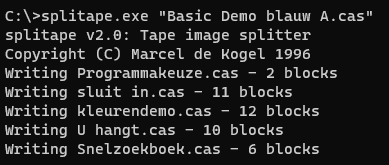

## P2000T Cassette Dumper

To archive/dump P2000T tapes to files on your PC, do the following:
* Run [Cassette Dumper.bas](</utilities/tapeconv/Cassette Dumper.bas>) on your P2000T. This will send all bytes of one side of the inserted tape through the P2000's serial port, at a baudrate of 9600 with no parity, 8 data bits, 1 startbit and 1 stopbit
* [Optionally] Run splitape.exe to split the full tape file into individual `.cas` program files

### Detailed instructions (in Dutch)

Dit is de hardware en software die ik heb gebruikt om P2000T cassettes te archiveren/dumpen naar bestanden onder Windows:

* Een USB naar 9-pin RS-232 adapter. Te vinden op bijv. https://www.onlinekabelshop.nl/usb-naar-9-pins-serieel-rs-232-adapter-0-80-meter \
De driver voor deze adapter kun je hier vinden: https://files-onlinekabelshop.nl/Handleidingen/OKS-27684_Drivers.zip
 
* Een adapter van 25 pin (m) naar 9 pin (v) RS-232:  https://www.onlinekabelshop.nl/adapter-db25-m-db9-v \
Trouwens: kabel en adapter kun je ook veel goedkoper op AliExpress bestellen, maar dan moet je wel rekenen op langere wachttijd.
 
* M.b.v. de kabel en adapter maak je dan een verbinding tussen de P2000T (seriele poort) en je laptop (USB poort).
 
* Tik dan (eenmalig) het programma [Cassette Dumper.bas](</utilities/tapeconv/Cassette Dumper.bas>) over op je P2000T en bewaar deze m.b.v. `CSAVE` op een cassette voor de volgende keer. \
Als je dit programma al eerder had ingetikt, dan kun je het gewoon inladen uiteraard. \
En als je al `pc2p2000t.bas` hebt, dan kun je daarmee ook direct [Cassette Dumper.cas](<../../cassettes/utilities/Cassette Dumper.cas>) inladen op je P2000T.
 
* Na het intikken/inladen van `Cassette Dumper.bas` run je deze d.m.v. `RUN` en doe je de cassette in de P2000T die je wil gaan archiveren. Let op: druk nog niet op een toets! \
 Het archiveren gaat per kant van de cassette, dus je moet zowel de voor- als achterkant doen.
 
* Op Windows (ik gebruik Windows 10) kun je bij Device Manager zien op welke COM-poort de USB-adapter is gemapt. Dat was in mijn geval COM4. Als het COM-nummer bij jou anders is, vervang in de instructies hieronder `COM4` voor het andere COM poort nummer.
 
* Daarna op je PC een Command Prompt openen en m.b.v. het 'MODE' commando de baudrate (9600), parity (geen), databits (8) en stopbits (1) zetten voor de betreffende COM poort:
  ``` 
  mode COM4 BAUD=9600 PARITY=n DATA=8 STOP=1
  ```
 
* Daarna op je PC het volgende commando uitvoeren om inkomende data van de COM-poort te bewaren in een tape image file
  ```
  type com4: >> mijntape.cas
  ```

* Daarna op de P2000T een toets indrukken, waarmee het archiveren/dumpen gaat beginnen, die de gehele inhoud van één kant van de cassette via RS-232 naar je PC verstuurt.
 
* Na verloop van tijd is het archiveren klaar (duurt maximaal 3 minuten per kant van een cassette), waarna je Ctrl-C doet in de Windows Command Prompt, zodat het archief bestand wordt gesloten.

* [Optioneel] Gebruik het programma `splittape.exe` om de tape image file (bijv. `Basic Demo blauw A.cas`) op te splitsen in losse `.cas` programma's: \

