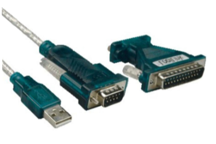

## PC2P2000T - vanaf PC naar P2000T programma's laden via de seriële poort

[pc2p2000t](pc2p2000t.bas) is een utility gemaakt voor de P2000T waarmee je via de seriële poort één of meerdere .cas programma's vanaf een PC kunt inladen. Na het laden van een programma naar de P2000T kun je deze dan starten d.m.v. `RUN`, maar ook wegschrijven naar mini-cassette d.m.v. `CSAVE`.

Er bestond al een utility [SERIAL.BAS Tape Converter](../tapeconv) van Marcel de Kogel, waarmee je een complete mini-cassette vanaf de P2000T naar je PC kan wegschrijven via de seriële poort. Maar pc2p2000t werkt dus precies de andere kant op.

De overdrachtssnelheid van deze utility is 9600 baud (9600 bits per seconde), waarmee het zelfs sneller is dan het laden van een P2000T cassette, dat met ongeveer 6000 baud gaat.

pc2p2000t werkt voor alle P2000T modellen, dus met 16K, 32K of >48K aan RAM geheugen.

Om deze utility te gebruiken heb je de volgende hardware nodig:
* Een P2000T;
* Een PC met daarop de .cas bestanden die je wilt laden naar je P2000T;
* Een kabel/adapter waarmee je de 25-pins seriële poort van de P2000T aan je PC kunt koppelen. Omdat de meeste PC's tegenwoordig geen seriële poort meer hebben, kun je in dat geval een USB-naar-serieel adapter kabel gebruiken.  \
  Online kun je zo'n kabel vinden door te zoeken op "USB to serial RS-232 adapter". Hieronder een paar voorbeelden van hoe zo'n kabel/adapter eruit kan zien:\
   

Als je alle hardware beschikbaar hebt, tik dan deze 32 regels BASIC code op je P2000T:
```
10 REM P2000 programma laden via RS232
20 REM Versie 0.3 door Dion Olsthoorn
30 CLEAR 50,&H9DFF+256*32*(PEEK(&H605C)+(PEEK(&H605C)=1))
40 M=PEEK(&H605C) : Z = 32*(M+(M=1))
50 BASE = &H9E00 + 256*Z
60 T=0 : I=0 : PRINT CHR$(12)
70 READ P$ : IF P$="stop" THEN GOTO 110
80 P=VAL("&H"+P$) : POKE BASE+I,P
90 IF P=&H9E OR P=&H9F THEN POKE BASE+I,P+Z
100 I=I+1 : T=T+P : GOTO 70
110 IF T=11963 THEN GOTO 130
120 PRINT "Typefout gemaakt in DATA" : END
130 DEF USR1=BASE + &H1D
131 DEF USR2=BASE + &H6C
140 PRINT "Start ontvanger op P2000T met ?USR1(0)"
141 PRINT "of ?USR2(0) voor ontvang-bewaar modus"
150 PRINT "Dan op PC .cas bestand zenden naar COM"
160 PRINT "9600 baud, geen parity en 8 data bits"
200 DATA C5,DB,20,E6,01,20,FA,06,15,10
210 DATA FE,06,08,DB,20,1F,CB,19,C5,06
220 DATA 10,10,FE,C1,10,F3,79,C1,C9,F3
230 DATA 06,00,21,00,9F,CD,00,9E,77,23
240 DATA 10,F9,21,4F,9F,4E,2A,30,9F,18
250 DATA 07,06,00,CD,00,9E,10,FB,11,00
260 DATA 04,CD,00,9E,77,23,1B,7A,B3,20
270 DATA F6,0D,20,E9,11,47,65,2A,34,9F
280 DATA 19,22,05,64,22,07,64,22,09,64
290 DATA 3A,B9,63,C6,02,32,B9,63,32,59
300 DATA 62,3E,07,CD,4A,10,FB,C9,CD,1D
310 DATA 9E,21,30,9F,11,30,60,01,20,00
320 DATA ED,B0,3E,05,CD,18,00,C3,6C,9E
330 DATA stop
```
Bewaar dit vervolgens op een P2000T cassette, zodat je het de volgende keer weer kunt gebruiken. Noem het bijvoorbeeld `pc2p2000t.bas`.

Daarna de PC koppelen aan de seriële poort van de P2000T (via het RS232-to-USB adapter kabeltje).
Op Windows kun je bij de Device Manager kijken op welke COM-poort de USB adapter is gemapt. In mijn geval is dat COM5. In de voorbeelden hieronder moet je dus jouw eigen COM-poort nummer gebruiken i.p.v. `com5`.

Dan op de PC een command prompt openen om voor deze COM poort de juiste baudrate etc. instellen (9600 baud, geen parity en 8 data bits):
```
mode com5 baud=9600 parity=n data=8 stop=1
```
Dan op de P2000T de pc2p2000t.bas utility laden en "installeren" door `RUN` te doen. Daarna het volgende commando op de P2000T om pc2p2000t te starten en te laten luisteren naar de seriële poort:
```
?USR1(0)
```
En vervolgens op de PC een .cas bestand sturen naar de juiste COM poort - als voorbeeld hieronder het bestand BrickWall.cas:
```
copy BrickWall.cas \\.\com5
```
Als alle bytes ontvangen zijn, dan hoor je een pieptoon, waarna de cursor weer te zien is op zowel de P2000T als je PC. Dit betekent dat het programma succesvol is ingeladen.
Hierna kun je het ingeladen spel bewaren op cassette met `CSAVE` of direct spelen met `RUN`.

### Ontvang-bewaar modus

De laatste versie van de pc2p2000t utility heeft nu ook een **ontvang-bewaar modus**, die te activeren is d.m.v. `?USR2(0)` i.p.v. `?USR1(0)`. Hierbij kun je vanaf de PC iedere keer een los .cas bestand naar de P2000T sturen, die dan direct na ontvangst op cassette wordt bewaard, waarna de P2000T dan weer gaat wachten op het volgende .cas bestand. Zo kun je dus een hele reeks .cas bestanden in één keer naar cassette wegschrijven.

Ook kun je de [sendcas.py](sendcas.py) Python utility gebruiken, die zelf de COM-poort juist instelt en ook niet-gesplitste .cas bestanden zoals [Basic Demo cassette (kant A).cas](<../../cassettes/demos/Basic Demo cassette (kant A).cas>) of [ErrorSoft.cas](../../cassettes/games/ErrorSoft.cas) correct kan overzetten.
```
usage: python sendcas.py [-h] serial_port cas_file_path [cas_file_path ...]
example: python sendcas.py COM4 games\Fraxxon.cas games\Brick-Wall.cas
```

Zorg bij het gebruik van de ontvang-bewaar modus wel voor dat:
* De cassette waarnaar je wilt schrijven leeg is;
* Alle programma's bij elkaar maximaal 40 blokken zijn, want meer past er niet op een originele P2000T cassette;
* De eerste letter van ieder Basic bestandsnaam, zoals te vinden in de .cas header, uniek is;
* De PC na het verzenden van ieder .cas bestand een tijdje wacht (afhankelijk van de grootte van het bestand) voordat het volgende .cas bestand weer wordt verzonden. Op die manier krijgt de P2000T genoeg tijd om het zojuist ontvangen bestand op cassette te bewaren voordat het klaar is om het volgende bestand te ontvangen. N.B. de `sendcas.py` utility doet dit wachten uit zichzelf al.

### Op zoek naar .cas games?

Op github zijn veel .cas games te vinden: https://github.com/p2000t/software/tree/master/tapes/games \
Voor grote spellen zoals [Fraxxon.cas](../../cassettes/games/Fraxxon.cas) heeft je P2000T mimaal een 16K RAM geheugenuitbreiding nodig. Als je zo'n geheugenuitbreiding zoekt, kijk dan eens op marktplaats bij gebruiker [ifilot](https://www.marktplaats.nl/u/ifilot/15277239/) die ze zelf maakt!

### Tips:
* Om te testen of de kabel werkt, kun je in een Windows command prompt de baudrate van de COM-poort op 1200 zetten d.m.v.   
  ```
  mode com5 baud=1200 parity=n data=8 stop=1
  ```
  en daarna het `TYPE COM5` commando geven (gebruik ipv '5' jouw eigen COM nummer), waarna je op de P2000T `<shift><00>` (de printer-key) indrukt. Dit stuurt alles op het scherm van je P2000T naar je PC, dus als het goed is zie je die tekst verschijnen in de command prompt.
* De `mode` instellingen die je op de PC doet, worden weer gereset naar de standaard waarden als je de USB stekker los- en daarna weer vastmaakt.
